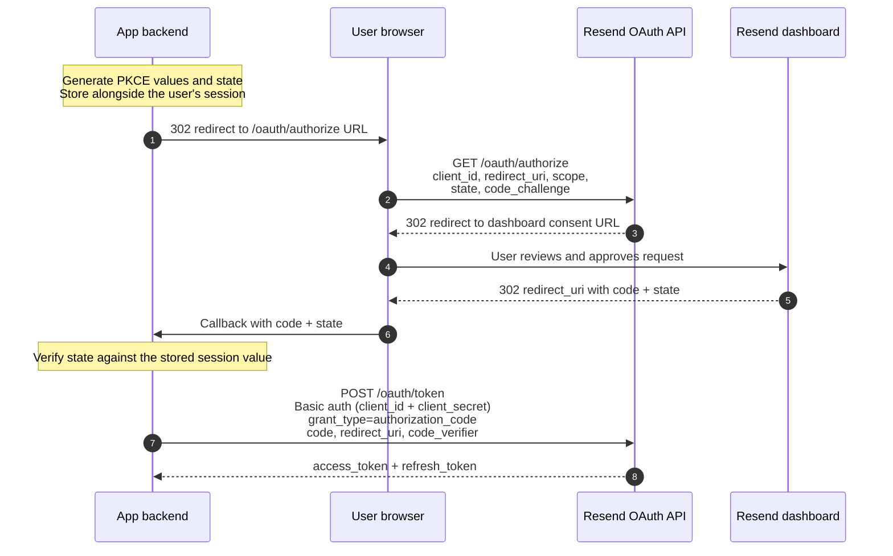
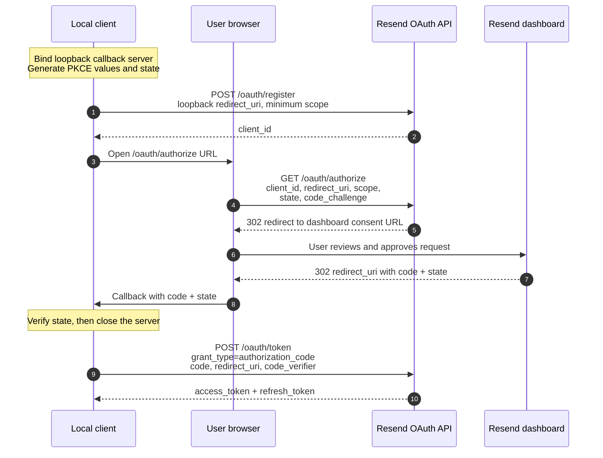

> ## Documentation Index
> Fetch the complete documentation index at: https://resend.com/docs/llms.txt
> Use this file to discover all available pages before exploring further.

# Building an OAuth client for Resend

> Implement an OAuth 2.1 + PKCE client against the Resend API, from scratch or with a library.

Resend implements OAuth 2.0 and 2.1, including Proof Key for Code Exchange (PKCE) for authorization code exchanges. A client's `client_id` comes from one of three places:

1. Pre-registration: Resend issues a fixed `client_id`, plus a `client_secret` if the client has a backend.
2. [Client ID Metadata Document](#client-id-metadata-documents) (CIMD): the `client_id` is the HTTPS URL of a JSON document you host, which Resend fetches to read the client's metadata.
3. Dynamic Client Registration (DCR): the client registers itself at runtime via POST /oauth/register and is issued a `client_id` then.

**Prefer CIMD over DCR:** it gives the client one identity across every install instead of a new registration each time, and the consent screen can name the host that published the document rather than a name the client picked for itself.

Resend supports both **public** and **confidential** clients. PKCE is required on every authorization code exchange regardless of type:

* **Public clients** authenticate with PKCE alone. Register them with `token_endpoint_auth_method: "none"` (the default), or declare that value in the metadata document. Use a public client when it can't keep a secret, such as native apps, CLIs, and single-page apps. A CIMD client is always public, since its document is world-readable and can't carry a secret.
* **Confidential clients** additionally present a `client_secret` at the token and revocation endpoints. Register them with `token_endpoint_auth_method: "client_secret_basic"` (or `client_secret_post`) to have Resend issue the secret. Use a confidential client when it has a backend that can store the secret privately, such as a server-side web app.

Because Resend does not offer self-service verification or domain-ownership checks yet, pre-register remote third-party clients rather than registering them dynamically, but you can register them with the same register endpoint.

The Resend dashboard hosts the login and consent screen. Your client only needs to open the authorization URL in a browser and handle the callback. You don't build any consent UI yourself.

## Recommended implementation paths

The standard case is registering beforehand, and the worked examples below use it. A metadata document is the next best thing for clients that can't predict their own deployment details ahead of time, like an MCP server: it works for hosted apps and local tools alike, and one document serves every install. Register dynamically only when the client can't host a document.

Also decide whether the client is public or confidential. A client running entirely on the user's machine, such as a native app, CLI, or single-page app, can't hide a secret, so register it as public (`none`). A client with a server-side backend should register as confidential (`client_secret_basic`) and keep the issued `client_secret` out of any user-facing code. That choice only applies to a registered client, since a CIMD client is always public. The [pre-registered remote client](#pre-registered-remote-client) section below covers the confidential path, and the [local client](#local-client) section covers the public one.

## Scopes

Use the smallest scope that works for your integration:

* `emails:send` is enough for send-only routes, such as `POST /emails`, `POST /email`, `POST /emails/sending`, `POST /email/sending`, and `POST /broadcasts/:broadcastId/send`.
* `full_access` is required for other API routes.

A client that omits `scope` gets both scopes by default, whether it registered dynamically or declared no `scope` in its metadata document. Pass `scope` explicitly during registration and authorization instead of relying on that default.

## Request encoding and `resource`

Dynamic client registration uses JSON, and so does a metadata document. The token and revocation endpoints accept both JSON and `application/x-www-form-urlencoded`, but prefer form encoding for `/oauth/token` and `/oauth/revoke`, since that's what most OAuth libraries send by default.

Resend does not support RFC 8707 resource indicators yet. Don't send or rely on `resource` in authorization or token requests. It's accepted but ignored.

## Generating PKCE values and state

Before starting the authorization request, generate three values:

* `code_verifier`: a high-entropy random string kept only by the client. See
  [Token](/docs/api-reference/oauth/token#pkce) for the length and character set it
  must use.
* `code_challenge`: the base64url-encoded SHA-256 hash of the `code_verifier`.
* `state`: a high-entropy random string used to bind the callback to the request that started the flow.

The `code_verifier` is sent only during the token exchange. The `code_challenge` is sent during authorization. The `state` is sent during authorization and must come back unchanged on the callback.

```javascript theme={"theme":{"light":"github-light","dark":"vesper"}}
import { createHash, randomBytes } from 'node:crypto';

function base64url(input) {
  return Buffer.from(input).toString('base64url');
}

const codeVerifier = base64url(randomBytes(64));
const codeChallenge = base64url(
  createHash('sha256').update(codeVerifier).digest(),
);
const state = base64url(randomBytes(24));
```

For a remote client, store `state` and `codeVerifier` server-side before redirecting the user to us. For a local client, keep them in memory while the temporary callback server is running.

## Client ID Metadata Documents

Instead of registering, host a JSON document that describes the client and pass its HTTPS URL as the `client_id`:

```
GET /oauth/authorize?client_id=https%3A%2F%2Fexample.com%2Foauth%2Fclient.json&response_type=code&...
```

Resend fetches that URL, reads the client metadata from it, and runs the rest of the flow exactly as it does for a registered client. There's no registration call and no issued `client_id` to store. The client hardcodes its own document URL, and sends the same value as `client_id` at `/oauth/token` and `/oauth/revoke`.

This follows the [OAuth Client ID Metadata Document](https://datatracker.ietf.org/doc/draft-ietf-oauth-client-id-metadata-document/) draft. The rules below are the parts specific to Resend.

Host the document on a site you control, whatever the client is. A hosted app serves it next to the app and lists its own `https` callback. A CLI or desktop app serves it on the vendor's website and lists loopback callbacks, since the document only has to name the client, not run it.

### The document

```json theme={"theme":{"light":"github-light","dark":"vesper"}}
{
  "client_id": "https://example.com/oauth/client.json",
  "client_name": "Example App",
  "client_uri": "https://example.com",
  "logo_uri": "https://example.com/logo.png",
  "redirect_uris": ["https://example.com/oauth/callback"],
  "grant_types": ["authorization_code", "refresh_token"],
  "response_types": ["code"],
  "token_endpoint_auth_method": "none",
  "scope": "emails:send"
}
```

The fields are the [registration](/docs/api-reference/oauth/register) fields, with extra rules:

| Field                        | Rule                                                                                                                                   |
| ---------------------------- | -------------------------------------------------------------------------------------------------------------------------------------- |
| `client_id`                  | Required. Must equal the document's own URL, character for character.                                                                  |
| `client_name`                | Required, 1–200 characters.                                                                                                            |
| `redirect_uris`              | Required, 1 to 10 entries. An `https` URI must be on the same host as the document. See [Redirect URIs](#redirect-uris-in-a-document). |
| `token_endpoint_auth_method` | Must be `none`, or omitted. A document is public, so it can't authenticate with a secret.                                              |
| `client_secret`              | Must be absent.                                                                                                                        |
| `jwks`, `jwks_uri`           | Must be absent. Resend doesn't support `private_key_jwt`.                                                                              |
| `grant_types`                | Must include `authorization_code`. Values Resend doesn't support are ignored rather than rejected.                                     |
| `response_types`             | If present, `["code"]` only.                                                                                                           |
| `scope`                      | Space-delimited, and every value must be [supported](#scopes). Pass it explicitly: an omitted `scope` gives the client both scopes.    |
| `logo_uri`                   | Optional, `http` or `https`. Shown on the consent screen only when it's served from the same host as the document.                     |
| `client_uri`                 | Optional. Read but not otherwise used.                                                                                                 |

Apart from `grant_types`, a declaration Resend can't honor fails the whole document rather than being dropped from it. A client that declares `private_key_jwt`, for instance, gets an error rather than being downgraded to an unauthenticated one.

### The document URL

The URL is the client's identity, and it's compared as an exact string with no normalization. Serve the document at a URL that survives a parse-and-serialize round trip: lowercase host, no explicit `:443`, no `.` or `..` segments. It must use `https`, have a path (`https://example.com` alone won't do), and carry no fragment and no userinfo. Maximum 2048 characters.

Treat the URL as permanent. Moving the document makes a different client, and every user has to authorize again.

### Redirect URIs in a document

A document proves that you control its host, and nothing else:

* An `https` redirect URI must be on the same host as the document URL. A document at `https://example.com/oauth/client.json` can't name a callback on `app.example.net`.
* Loopback `http` URIs (`127.0.0.1`, `localhost`, `[::1]`) are exempt. A loopback address names the user's own machine rather than a publisher, so there's nothing to compare. Port variance works the same way it does for a registered client.
* Private-use URI schemes (e.g. `cursor://`) are exempt too, since they carry no web host at all.

### Hosting and caching

Resend fetches the document when a browser hits `/oauth/authorize`.

* Redirects aren't followed. Serve the document at the exact URL with a `2xx`.
* 5 KB maximum, 5 second timeout. A real document is a few hundred bytes.
* The document must be reachable. A fetch that fails, or a document that doesn't validate, fails the authorization with `invalid_client`. Resend won't fall back to an older copy, since a stale document can name a redirect URI you no longer control.
* `cache-control: max-age` is honored, clamped between 5 minutes and 24 hours. A document sent with `no-store` still gets the 5-minute floor.

Only `/oauth/authorize` fetches. Token, refresh, and revoke requests use the copy Resend already holds, so a document that's briefly unreachable doesn't break clients that already have a grant.

Because of the 5-minute floor, allow time for an edit to take effect. If a CDN caches the file too, the two windows stack.

### On the consent screen

Resend has no self-service verification yet, so a CIMD client is unverified. The consent screen headlines the document's host rather than `client_name`, since the host is the part Resend can check. `client_name` is shown as the client's own claim about itself.

Being unverified affects errors too. Once `client_id` and `redirect_uri` are validated, `/oauth/authorize` redirects an error back to the callback only when the target is a loopback address, a private-use scheme, or a verified client. An unverified `https` callback gets a JSON error instead, which stops the endpoint from being used as an open redirect. Handle both.

## Pre-registered remote client

A remote client must use an HTTPS redirect URI owned by the app, for example `https://example.com/oauth/callback`.

Because a remote client has a backend that can keep a secret, register it as confidential: pass `token_endpoint_auth_method: "client_secret_basic"` and store the `client_secret` Resend returns. That secret is shown only once at registration, so persist it securely and never expose it in browser or client-side code. It's then presented on every token and revocation call, in addition to PKCE.

For remote apps, you can still use [POST /oauth/register](/docs/api-reference/oauth/register) manually while we don't have a central place in the app to create clients.



<Steps>
  <Step title="Load the pre-issued client_id and client_secret" />

  <Step title="Generate PKCE and state">
    `code_verifier`, `code_challenge`, and `state`. See
    [above](#generating-pkce-values-and-state).
  </Step>

  <Step title="Store state and code_verifier server-side">
    Tie them to the user's session.
  </Step>

  <Step title="Redirect the user's browser to /oauth/authorize" />

  <Step title="Handle the callback on the app's backend" />

  <Step title="Reject invalid callbacks">
    A missing `code`, mismatched or missing `state`, or an `error` query
    parameter should all be treated as failures.
  </Step>

  <Step title="Exchange the code server-side">
    Use the original `code_verifier`, and present the `client_secret` via HTTP
    Basic auth.
  </Step>

  <Step title="Store the refresh token securely" />

  <Step title="Serialize refreshes">
    Atomically replace the stored refresh token after every refresh.
  </Step>
</Steps>

Example authorization URL:

```
GET /oauth/authorize?client_id=550e8400-e29b-41d4-a716-446655440000&response_type=code&redirect_uri=https%3A%2F%2Fexample.com%2Foauth%2Fcallback&scope=emails%3Asend&state=STATE_VALUE&code_challenge=CODE_CHALLENGE_VALUE&code_challenge_method=S256 HTTP/1.1
Host: api.resend.com
```

Example code exchange. The `-u` flag sends the `client_id` and `client_secret` as HTTP Basic auth, so `client_id` isn't repeated in the body:

```bash theme={"theme":{"light":"github-light","dark":"vesper"}}
curl -X POST 'https://api.resend.com/oauth/token' \
     -H 'Content-Type: application/x-www-form-urlencoded' \
     -u '550e8400-e29b-41d4-a716-446655440000:CLIENT_SECRET' \
     -d 'grant_type=authorization_code&code=AUTHORIZATION_CODE&redirect_uri=https%3A%2F%2Fexample.com%2Foauth%2Fcallback&code_verifier=CODE_VERIFIER_VALUE'
```

## Local client

A local client must use a loopback redirect URI or a private-use URI scheme, per RFC 8252. Prefer `127.0.0.1` with a random local port, for example `http://127.0.0.1:49152/oauth/callback`. A native app the operating system routes to can use its own scheme instead, such as `cursor://oauth/callback`.

Loopback redirect URIs allow port variance, whether they come from registration or from a metadata document. The host, path, and query string must still match, and `localhost` and `127.0.0.1` count as different hosts. For example, a client can declare `http://127.0.0.1/oauth/callback` and later authorize with `http://127.0.0.1:49152/oauth/callback`.

The sequence below registers dynamically. With a [metadata document](#client-id-metadata-documents), skip the registration step: the `client_id` is the document's URL, and the loopback redirect URI is listed in the document.



<Steps>
  <Step title="Bind a temporary callback server">
    Pick a random high port and bind it to `127.0.0.1` or `[::1]`, never
    `0.0.0.0`.
  </Step>

  <Step title="Generate PKCE and state">
    `code_verifier`, `code_challenge`, and `state`. See
    [above](#generating-pkce-values-and-state).
  </Step>

  <Step title="Get a client_id">
    Use the URL of a [metadata document](#client-id-metadata-documents) that
    lists the loopback redirect URI and the minimum required scope. If the
    client can't host one, register dynamically with the same values instead.
    See [Register Client](/docs/api-reference/oauth/register).
  </Step>

  <Step title="Open the authorize URL in the user's browser">
    Don't prefetch `/oauth/authorize` from your process and follow the redirect
    yourself. The user needs to see the consent screen.
  </Step>

  <Step title="Let the browser follow the redirect to the dashboard consent screen" />

  <Step title="Handle exactly one callback, then close the server" />

  <Step title="Reject invalid callbacks">
    A missing `code`, mismatched or missing `state`, or an `error` query
    parameter should all be treated as failures.
  </Step>

  <Step title="Exchange the code">
    Use the original `code_verifier`. See [Token](/docs/api-reference/oauth/token).
  </Step>

  <Step title="Store the newest refresh token after every token response" />
</Steps>

Close the loopback server after success or timeout.

### Dynamic client registration

Pass `scope` explicitly. If DCR omits `scope`, Resend registers the client with both scopes by default.

```bash theme={"theme":{"light":"github-light","dark":"vesper"}}
curl -X POST 'https://api.resend.com/oauth/register' \
     -H 'Content-Type: application/json' \
     -d $'{
  "client_name": "Example Local OAuth Client",
  "redirect_uris": ["http://127.0.0.1/oauth/callback"],
  "grant_types": ["authorization_code", "refresh_token"],
  "response_types": ["code"],
  "token_endpoint_auth_method": "none",
  "scope": "emails:send"
}'
```

The response returns a UUID `client_id`:

```json theme={"theme":{"light":"github-light","dark":"vesper"}}
{
  "client_id": "550e8400-e29b-41d4-a716-446655440000",
  "client_id_issued_at": 1750000000,
  "client_name": "Example Local OAuth Client",
  "redirect_uris": ["http://127.0.0.1/oauth/callback"],
  "grant_types": ["authorization_code", "refresh_token"],
  "response_types": ["code"],
  "token_endpoint_auth_method": "none",
  "scope": "emails:send"
}
```

### Authorization request

Do not have a backend or CLI process prefetch `/oauth/authorize` and then open the returned dashboard URL. Instead, open the authorization URL in the user's browser and let the browser follow the redirect to the dashboard.

```javascript theme={"theme":{"light":"github-light","dark":"vesper"}}
const authorizationUrl = new URL('https://api.resend.com/oauth/authorize');
authorizationUrl.search = new URLSearchParams({
  client_id: '550e8400-e29b-41d4-a716-446655440000',
  response_type: 'code',
  redirect_uri: 'http://127.0.0.1:49152/oauth/callback',
  scope: 'emails:send',
  state,
  code_challenge: codeChallenge,
  code_challenge_method: 'S256',
}).toString();

openBrowser(authorizationUrl.toString());
```

After approval, Resend redirects back to the exact `redirect_uri` used in the authorization request:

```
GET /oauth/callback?code=AUTHORIZATION_CODE&state=STATE_VALUE HTTP/1.1
Host: 127.0.0.1:49152
```

Verify that the returned `state` matches the original `state` before exchanging the code.

### Authorization code exchange

The `redirect_uri` in the token request must match the `redirect_uri` from the authorization request.

```bash theme={"theme":{"light":"github-light","dark":"vesper"}}
curl -X POST 'https://api.resend.com/oauth/token' \
     -H 'Content-Type: application/x-www-form-urlencoded' \
     -d 'grant_type=authorization_code&client_id=550e8400-e29b-41d4-a716-446655440000&code=AUTHORIZATION_CODE&redirect_uri=http%3A%2F%2F127.0.0.1%3A49152%2Foauth%2Fcallback&code_verifier=CODE_VERIFIER_VALUE'
```

The response includes a JWT access token and an opaque refresh token:

```json theme={"theme":{"light":"github-light","dark":"vesper"}}
{
  "access_token": "eyJhbGciOiJFUzI1NiIsImtpZCI6Im9hdXRoX2tleSIsInR5cCI6ImF0K2p3dCJ9...",
  "token_type": "Bearer",
  "expires_in": 900,
  "refresh_token": "JcL7aYfE7S9h3L4qv0o2e1w8m6n5b3x9RkP2tD4uV6Q",
  "scope": "emails:send"
}
```

### Refresh token exchange

Refresh tokens rotate on every successful refresh. Serialize refresh operations for a grant, and store the new refresh token atomically with the rest of the response. If refresh succeeds but the new refresh token isn't persisted, you'll need to reauthorize. Retrying an old token from multiple workers can revoke the whole grant: a replay fails with `invalid_grant` either way, and it also revokes the grant unless the rotation happened within the last minute. Don't rely on that window. See [Token](/docs/api-reference/oauth/token) for the reuse-detection details.

Each refresh resets the new token's 60-day lifetime, so a client that refreshes regularly never has to reauthorize.

```bash theme={"theme":{"light":"github-light","dark":"vesper"}}
curl -X POST 'https://api.resend.com/oauth/token' \
     -H 'Content-Type: application/x-www-form-urlencoded' \
     -d 'grant_type=refresh_token&client_id=550e8400-e29b-41d4-a716-446655440000&refresh_token=JcL7aYfE7S9h3L4qv0o2e1w8m6n5b3x9RkP2tD4uV6Q'
```

## Revoking access

To disconnect a client, revoke the refresh token:

```bash theme={"theme":{"light":"github-light","dark":"vesper"}}
curl -X POST 'https://api.resend.com/oauth/revoke' \
     -H 'Content-Type: application/x-www-form-urlencoded' \
     -d 'client_id=550e8400-e29b-41d4-a716-446655440000&token=JcL7aYfE7S9h3L4qv0o2e1w8m6n5b3x9RkP2tD4uV6Q&token_type_hint=refresh_token'
```

A confidential client must authenticate this request too, the same way it does at the token endpoint. For example, pass its `client_secret` with `curl -u 'CLIENT_ID:CLIENT_SECRET'` instead of sending `client_id` in the body.

Access tokens are JWTs and can't be revoked individually. Revoking the refresh token revokes the grant. See [Revoke Token](/docs/api-reference/oauth/revoke).
